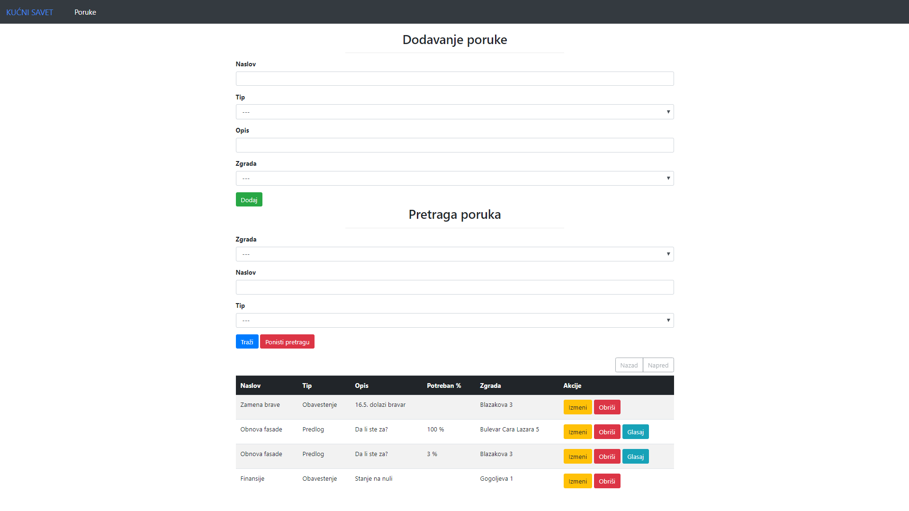
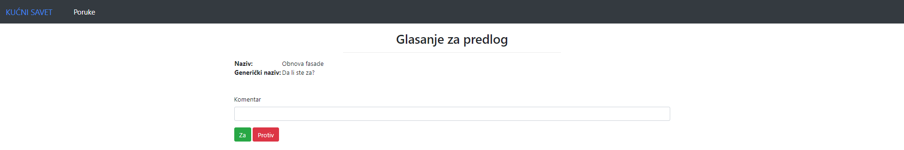

# Kućni savet
Aplikacija omogućava praćenje tekućih aktivnosti kućnih saveta. Osnovne funkcionalnosti:
- pregled svih poruka koji su upućeni predsednicima skupštine stanara
- pretraga poruka
- unos nove poruke

Tip poruke koji se može poslati predsedniku skupštine stanara zgrade može biti:
- obaveštenje
- predlog  (definiše se potreban procenat stanara koji je potrebno ostvariti kako bi predlog bio usvojen)

# Korišćene tehonologije
Backend: Java (Spring Framework)  
Frontend: AngularJS

# Postavka okruženja
1. Projekat importovati u IDE (Eclipse, IntelliJ IDEA, Netbeans)  
2. Proveriti konfiguracijske postavke kroz <b>pom.xml</b> i <b>application.properties</b> i uraditi eventualne izmene
2. Proveriti da li postoje instalirani MySQL drajveri 
3. U okviru MySQL Workbench-a (ili na neki drugi način) kreirati schemu baze
4. Pokrenuti projekat

# Screenshots

